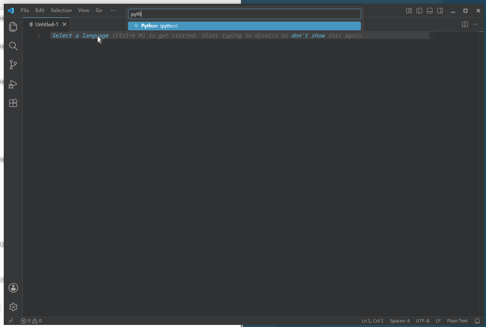
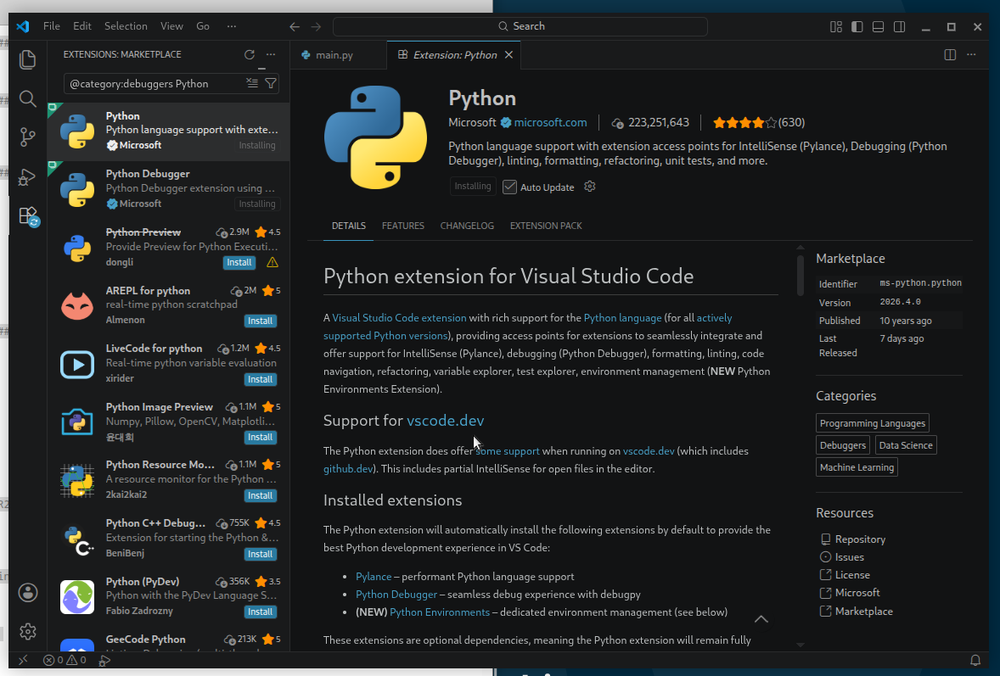
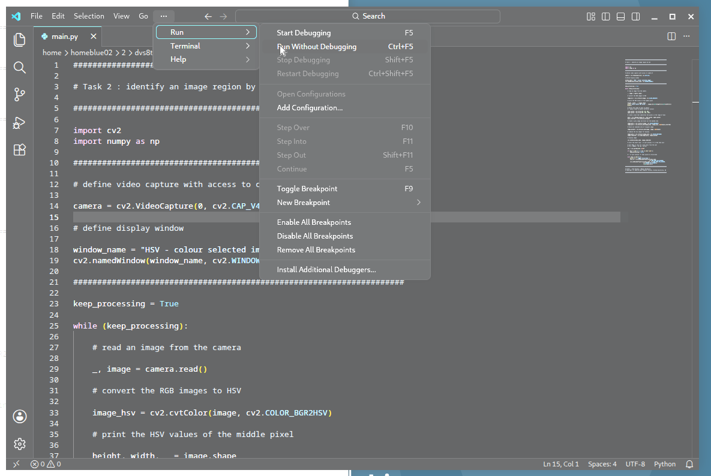

# Invisiblity Cloaking - Simple Steps in How This Works

[Chroma Keying via Colour Selection and Filtering in Real-time Video](https://github.com/tobybreckon/chroma-keying/)


## 1. Getting Started

Four quick steps to get you started:

1. Ensure the computer is **booted into Linux**

2. **Login** with the provided username and password 
  
   (**taped to desk** in fron of you)

3. Start **Visual Studio Code** (Menu: Applications > Programming > Visual Studio Code)



4. Click **"skip" to anything about logging into GitHub**

5. Within **Visual Studio Code** select menu item: **File  > New Text File**
    * Click the blue _"Select a language"_ and start to type _python_, then select/click the _Python_ option that appears (as shown above)
        - If _"Python"_ is not offered as a choice, press **Ctrl+Shift+X** and then search for _"Python"_ and press install
    * It may then say _"Do you want to install the recommended extensions for Python?"_ (_from Marketplace_ or similar)
    * Select the first option from the list on the left. Click blue _"Install"_ text and wait ~1 minute whilst everything is set up for you



**You are now ready to start coding**

## 2. Colour Selection in Live Video

Once you have completed the **Getting Started** steps:

* **copy and paste the code from this example**  [hsv_colour.py](https://raw.githubusercontent.com/tobybreckon/invisible/refs/heads/main/src/hsv_colour.py) into your Visual Studio Code window

* **save this file as ```main.py```** by selecting menu item: **File > Save As...** (then entering filename as ```main.py```)
 
* click _"Run > Run Without Debugging"_



- you should see **a live grey image from the webcam** displayed but if you hold up the **(green) chroma keying material you will see it's
colour is retained** (in green), as per the example below - _[ you can exit the program by pressing ```x``` or ```ESC```]_.


_If it doesn't work for you, you may need to adjust the range settings for the Hue value (first value of array) to get the correct range of green Hue, in the code lines:_

```
lower_green = np.array([55, 50, 50])
upper_green = np.array([95, 255, 255])
```

## 3. Colour Selection with point and click ....

We can add a point and click colour selector, try this:

- **copy and paste the code from this example**  [hsv_colour_select.py](https://raw.githubusercontent.com/tobybreckon/invisible/refs/heads/main/src/hsv_colour_select.py) into your Visual Studio Code window (replacing all earlier code) again save (File > Save)

- **hold up the (green) chroma keying material** and run it (click _"Run > Run Without Debugging"_)

- you should initially see a live colour image from the camera; **_left click_ on any object to select its Hue**

- you should now see **a grey image displayed but with the Hue colour that you selected retained** (for example just the green of the chroma keying material)
- _[ you can exit the program by pressing ```x``` or ```ESC``` ]_


**Advanced:** If you want to understand more about how images this works you can run each of the codes for RGB colour viewer [rgb_viewer.py](https://raw.githubusercontent.com/tobybreckon/invisible/refs/heads/main/src/rgb_viewer.py) and the HSV viewer 
 [hsv_viewer.py](https://raw.githubusercontent.com/tobybreckon/invisible/refs/heads/main/src/hsv_viewer.py). Run them as before (copy/paste ... _"Run > Run Without Debugging"_ etc). 
 
Objects of **certain colours (e.g. green) appear brighter in the corresponding colour channels of the RGB channels** (yet appear in all 3, making them diffficult to isolate), and similarly **vibrant colours have strong responses in the Hue and Saturation channels of HSV** - we commonly use the HSV colour representation to seperate out colours.

## 4. Building an Invisibility Cloak


We can use this to build an invisibility cloak using a **special effects technique known as chroma keying**.

To try this out:

- **copy and paste the code from this example** [invisibility_cloak.py](https://raw.githubusercontent.com/tobybreckon/invisible/refs/heads/main/src/invisibility_cloak.py) into your Visual Studio Code window (replacing all earlier code) again save (File > Save)

- **first point your webcam to a clear(ish) area of the room** with (ideally) no people or (green) chroma keying material in view - - **this will be the backround image used for cloaking**

- **run the code** (click _"Run > Run Without Debugging"_) 

- **2 windows** will be displayed:
    - **the current background image** in one window
    - **the live camera image** in the other

- **bring the (green) chroma keying material into view and _left click_ on it to select its Hue** as before

**You should now see objects that are covered by the chroma keying material are cloaked** using information from the background image.


You can **reset the background image by _pressing the space key_**; you can _right click_ to reset the Hue selection

#### How does this work ?

When the program starts up, it **stores an initial image of the clear area of the room** with no people or (green) chroma keying material in view. This is our _background_ image. 

Next, we use our earlier approach to **isolate the image region with a green Hue**, this is our _mask_ (or _cloak_)  region - we **replace the pixels** of this _mask_ region with those from the _background_ image. 

We use **computational bit-wise logical operations** such as NOT, AND and OR to perform this very efficiently in real-time.

##  5. Improving our Invisibility Cloak ....

To improve our cloaking approach, we use a couple **common computer science concepts** from _computational geometry_ and _computer graphics_:

- **Convex Hull**: 
    - **Problem:** the cloaked region is often broken up by internal areas where Hue colour isolation is poor or where the material is not fully covering. 
    
    - **Solution** = a **convex hull** operation allows us to extract the exterior contour around all of the _mask_ region pixels, and then use the full interior of this contour as an improved _mask_.

- **feathered blending**: 
    - **Problem:** we see strange edge artifacts at the joint between our cloak region and the live image.

    - **Solution** = using  **feathered blending** we slightly blur the edges between the _mask_ region and the corresponding edges of the _background_ image. These blured edges, are known as  _feathered_ edges and allow us to combine the two image regions via a computer graphics technique known as _alpha_-blending or _compositing_.

To try out these improvements, try the following code example as before - [invisibility_cloak_improved.py](https://raw.githubusercontent.com/tobybreckon/invisible/refs/heads/main/src/invisibility_cloak_improved.py). 


Here we use **efficient arithmetic operations** on a modern CPU to obtain improved real-time cloaking.

## 6. Chroma Keying for Real by Faking it ...


Finally, we **turn about the idea behind the invisibility cloak to provide ourselves with a virtual background** in the same way that chroma keying is used as a special effect in the film industry (or in the background changing features in video conferencing tools).

To try this out:

- **copy and paste the code from this example** [chroma_keying_background.py](https://raw.githubusercontent.com/tobybreckon/invisible/refs/heads/main/src/chroma_keying.py) into your Visual Studio Code window (replacing all earlier code) again save (File > Save)

- **download a suitable background image** from somewhere (e.g. free images from [unsplash](https://unsplash.com/backgrounds/desktop/computer) or perhaps of [Durham Cathedral](https://www.thisisdurham.com/dbimgs/durham-cathedral-background.jpg)) and **save it as ``background.jpg``* (wherever your _main.py_ is located)

- **run the code** (click _"Run > Run Without Debugging"_)

- **try to get as much of the scene behind you covered by the (green) chroma keying material** so that it provides you with a green backdrop.

-  **_left click_ somewhere on your green backdrop** to select its Hue as before

You should now see **your own chroma keyed backdrop where the (green) chroma keying material has been replaced with your saved image**.


---

**Instructor / Developer Notes + Acknowledgements:** see all at [Chroma Keying via Colour Selection and Filtering in Real-time Video](https://github.com/tobybreckon/chroma-keying/).

---
